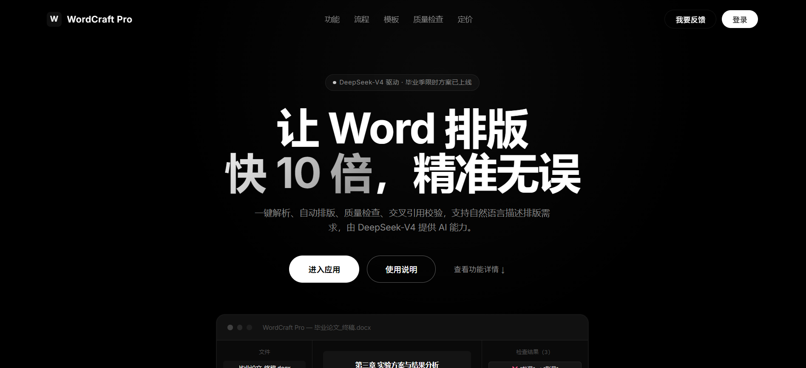
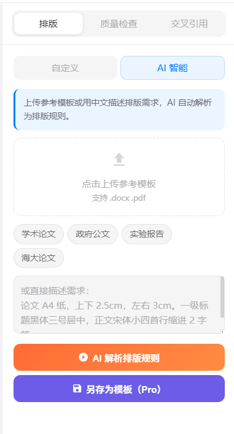
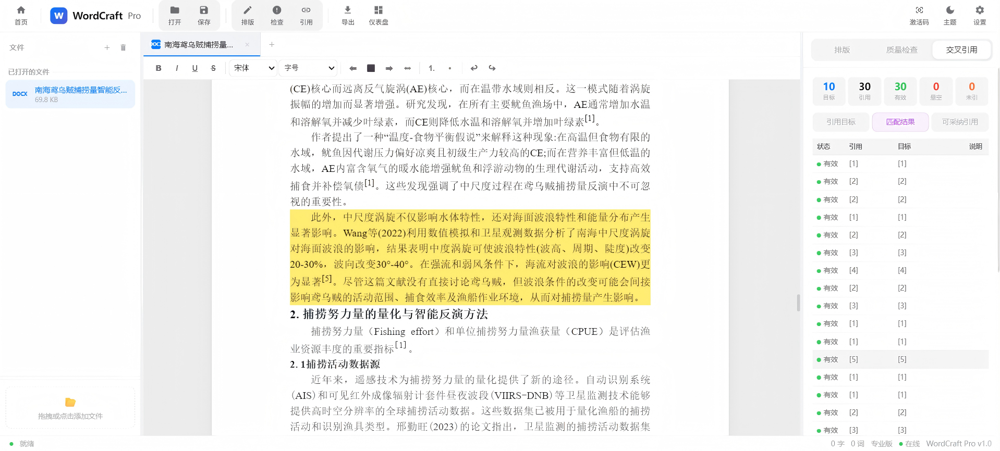
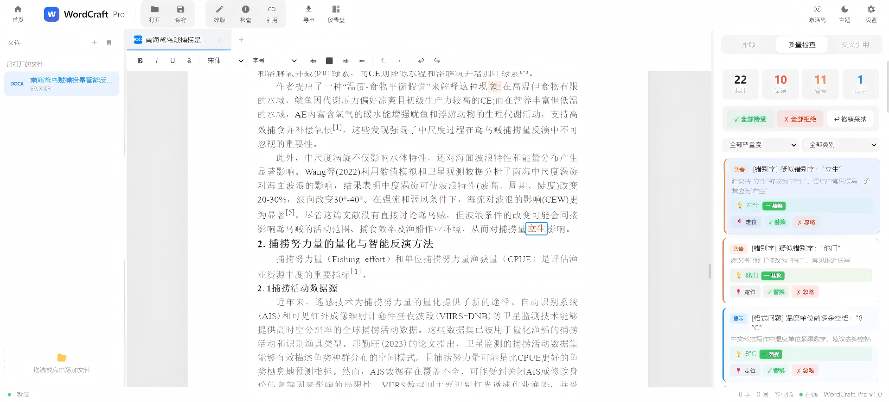
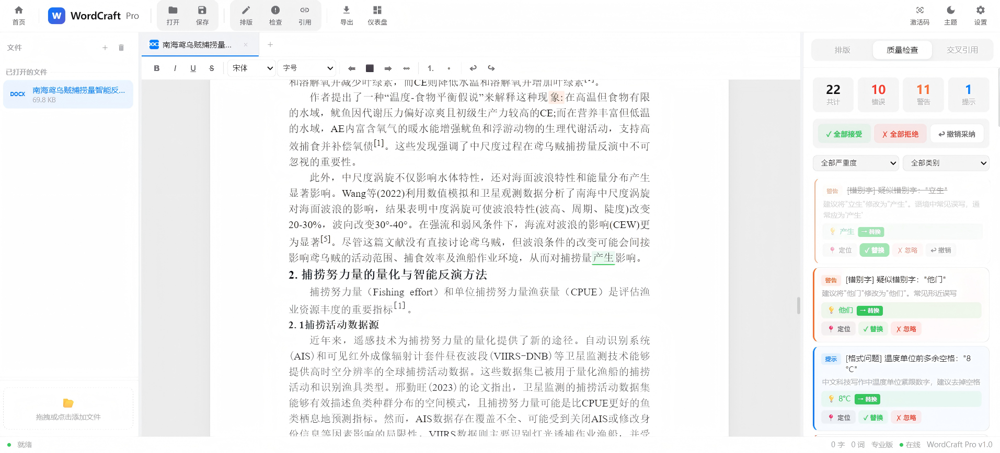
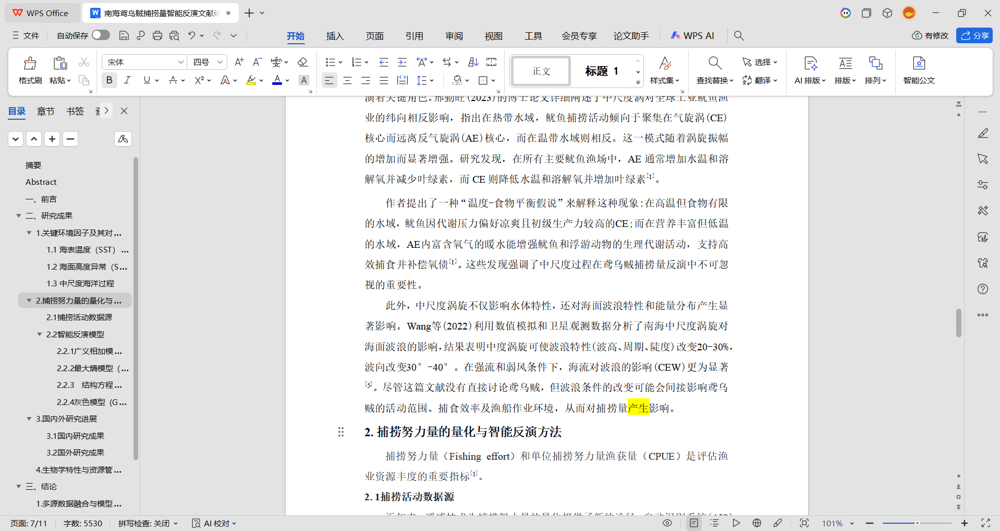

# WordCraft Pro

让文档处理不再“手工返工”。

WordCraft Pro 是一个面向中文文档场景的 Web 工具：上传文档 -> 统一解析 -> 一键排版 -> 质量检查 -> 导出 `.docx`。  
适合论文、报告、公文、评审材料等高频文档场景。

> 当前版本：`v1.0.0`  
> 架构：`Flask API + 单页 Web`  
> AI 模型：`DeepSeek-v4`（OpenAI 兼容接口）

---

## 核心体验（图文交替）

### 1) 打开就能用：主页入口清晰

上传、排版、检查、导出都在同一条流程里，不需要来回切多个工具。

<p align="center">
  
</p>

---

### 2) 排版集中处理：一次设定，整篇生效

在排版工作区统一调整字体、字号、行距、缩进、页边距，减少手工重复操作。

<p align="center">
  
</p>

---

### 3) QA 自动检查：先发现问题，再决定怎么改

自动提示错别字、数据一致性、逻辑和标点问题，把“人工通读”变成“重点复核”。

<p align="center">
  
</p>

---

### 4) 交叉引用可视化：问题位置直接高亮

图表/章节引用异常会在界面里直接定位，避免最终导出后才发现引用错位。

<p align="center">
  
</p>

---

### 5) 错别字修复有过程：能看见每一步变化

这三张图分别是：先定位问题，再看修改结果，最后看导出后在 WPS 里的实际显示效果。

<p align="center">
  
  
  
</p>

---

## 三分钟上手

### 1) 环境准备

- Python `3.10+`
- Windows / macOS / Linux

### 2) 安装依赖

```bash
pip install -r requirements.txt
```

如果只想最小安装：

```bash
pip install python-docx pdfplumber openpyxl PyYAML pydantic openai flask flask-cors supabase
```

### 3) 启动后端

```bash
cd web
python flask_app.py
```

后端地址：`http://127.0.0.1:5000`

### 4) 启动前端

```bash
cd web
python run_web.py
```

前端地址：`http://127.0.0.1:8081`

> Windows 终端乱码可先执行：`chcp 65001`

---

## 你会得到什么能力

| 能力 | 说明 |
|------|------|
| 多格式解析 | 统一读取 `.docx/.doc/.pdf/.xlsx/.xls/.txt/.md` |
| `.doc` 支持 | 可直接上传 `.doc`，后端自动转换为 `.docx` 链路处理 |
| 智能排版 | 根据 YAML 模板批量设置字体、字号、间距、缩进、页边距 |
| AI 规则解析 | 用自然语言描述格式要求，自动映射到结构化规则 |
| 质量检查（QA） | 错别字、数字/日期一致性、标点规范、逻辑问题提示 |
| 交叉引用检查 | 检测悬空引用、未引用目标、重复编号 |
| `.docx` 导出 | 中西文字体分别设置，降低 Word 打开乱码概率 |

---

## 架构速览（读这段就够）

- `app.py`：**业务逻辑单一来源**（`Api` 类及核心能力）。
- `web/flask_app.py`：薄路由层，只负责 HTTP -> `Api`。
- `web/index.html`：单页前端（无打包构建步骤）。
- `core/document_model.py`：统一数据模型，解析器与引擎都围绕它工作。
- `parsers/dispatcher.py`：按扩展名分发解析，并承接 `.doc` 上传转换流程。

AI 调用路径：

1. 优先走 Supabase Edge Function 代理（`/functions/v1/ai-proxy`）
2. 回退到 OpenAI 兼容接口（当前模型：`DeepSeek-v4`）

返回约定：

- 成功：`{"content": "...", "usage": {...}}`
- 失败：`{"error": "..."}`

---

## 项目结构（精简版）

```text
wordcraft-pro/
├── app.py
├── core/
├── llm/
├── parsers/
├── templates/
├── web/
├── tests/
└── README.md
```

重点文件：

- `app.py`：业务逻辑总入口
- `web/index.html`：前端主界面
- `web/flask_app.py`：后端路由包装
- `core/qa_engine.py`：QA 编排
- `parsers/dispatcher.py`：解析分发与 `.doc` 处理

---

## 配置示例（DeepSeek）

在 `config.yaml` 中：

```yaml
llm:
  mode: "api"
  api:
    provider: "deepseek"
    api_key: "your-api-key"
    base_url: "https://api.deepseek.com"
    model: "DeepSeek-v4"
    temperature: 0.3
    max_tokens: 4096
```

未配置 API Key 时会进入 `MockLLMClient`，不影响基础文档处理流程。

---

## 模板示例（YAML）

```yaml
template_name: "我的论文模板"
template_type: "thesis"

body:
  font_name_cn: "宋体"
  font_name_en: "Times New Roman"
  font_size_pt: 12
  first_indent_chars: 2
  line_spacing_value: 1.5
```

内置模板位于 `templates/`，自定义模板建议放 `templates/custom/`。

---

## 测试命令

```bash
python -m pytest tests/test_batch_regression.py -v
python -m pytest tests/test_format_checker.py -v
python -m pytest tests/e2e/test_batch7_e2e.py -m "e2e and no_login" -v
```

---

## 技术栈

| 类别 | 技术 |
|------|------|
| 后端 | Flask + Flask-CORS |
| 前端 | 原生 HTML/CSS/JS（无构建） |
| 文档处理 | python-docx / pdfplumber / openpyxl |
| AI | DeepSeek（OpenAI 兼容） |
| 云服务 | Supabase（Auth / DB / Storage） |

---

## 已知边界

- 当前仅维护 Web 版（不维护 pywebview 桌面版）。
- 微信登录仍在开发中（当前主路径为邮箱登录）。
- PDF 导出尚未实现（当前重点是 `.docx` 导出与在线编辑流）。

---

## 许可证

本项目仅供学习与研究使用。
